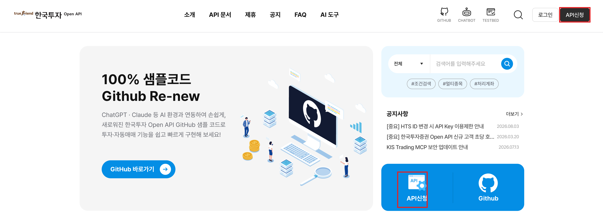
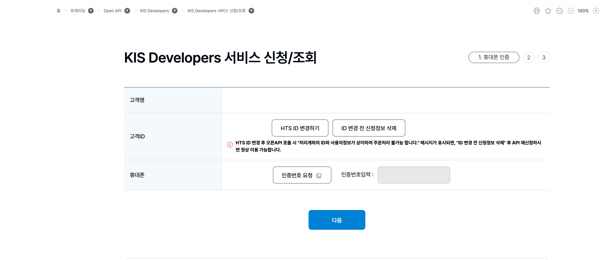
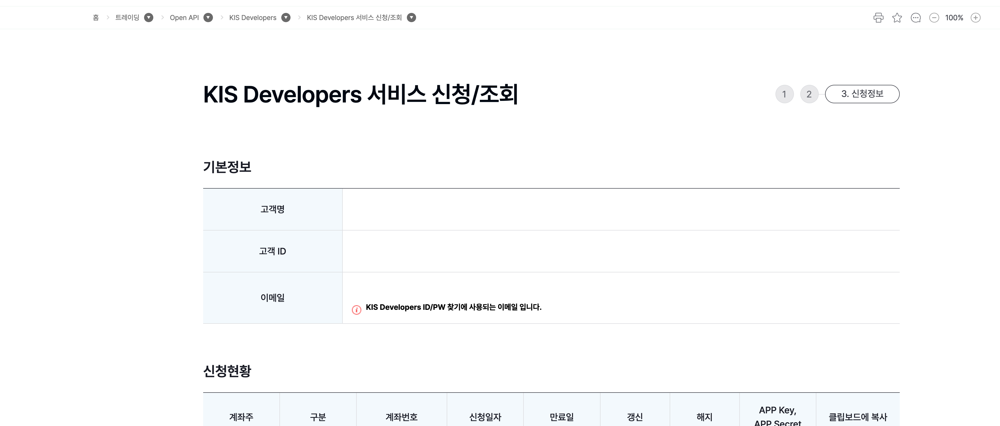
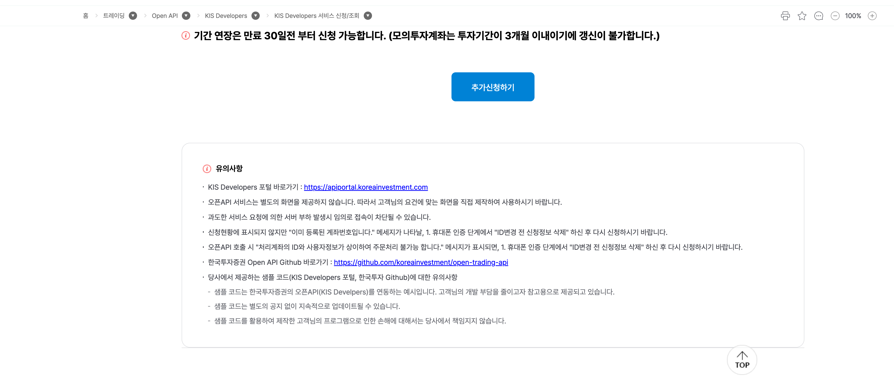
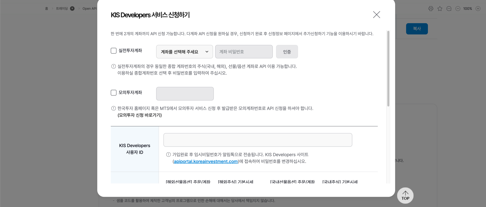
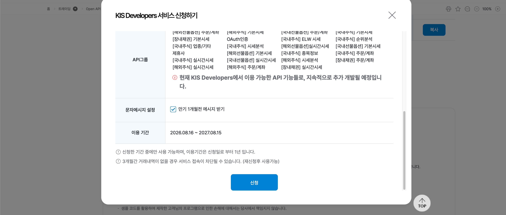
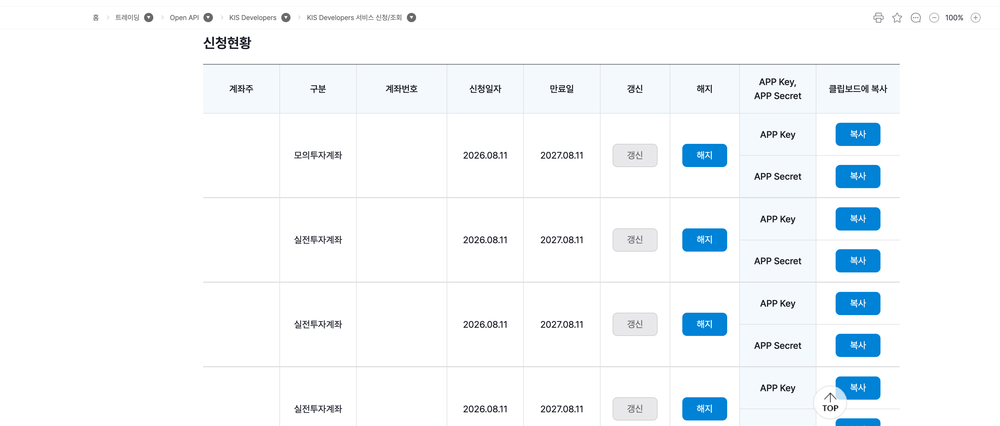

# 앱키 발급받기

한국투자증권 홈페이지에서 Open API 앱키(**APP Key**)·앱시크릿(**APP Secret**)을 발급받는 과정을
화면과 함께 따라합니다. 발급받은 두 값은 [3. 자격증명과 프로필](configuration.md)에서 저장합니다.

::: {.callout-tip}
처음이라면 **모의투자용부터** 발급받아 연습하는 것을 권장합니다. 실전은 익숙해진 뒤에 발급하세요.
(실전용과 모의투자용 앱키는 **따로** 발급됩니다.)
:::

## 준비

- 한국투자증권 **실계좌**가 있어야 합니다(없으면 먼저 개설). 그리고 HTS/MTS 등에서 **API 서비스
  신청(사용 동의)**을 해야 합니다.
- 신청 화면으로 가는 방법은 두 가지입니다:
  - **KIS 개발자센터** <https://apiportal.koreainvestment.com/intro> 에서 오른쪽 맨 위의 검정색
    **API 신청** 버튼(또는 본문의 파란색 **API 신청** 버튼)을 누릅니다.
  - 또는 홈페이지 로그인 후 **트레이딩 > Open API > KIS Developers > KIS Developers 서비스 신청/조회**
    로 이동합니다.

## 휴대폰 인증

본인 휴대폰으로 인증번호를 받아 인증합니다.

## 신청정보 확인

기본정보(고객명·고객 ID·이메일)를 확인합니다.

같은 페이지 아래쪽의 **추가신청하기**(최초라면 **신청하기**) 버튼으로 계좌에 API 이용을 신청합니다
(유의사항도 함께 안내됩니다).

## API 서비스 신청하기

앱키·앱시크릿을 발급받으려면 계좌에 API 이용을 신청해야 합니다. 위 버튼을 누르면 뜨는 창에서,
실전투자계좌는 종합계좌를 고르고 계좌 비밀번호로 인증하며, 모의투자계좌는 발급받은 모의계좌번호를
입력합니다. **KIS Developers 사용자 ID**도 함께 정합니다.

사용할 **API 그룹**을 선택하고 **신청**을 누릅니다.

## 신청현황에서 APP Key · APP Secret 복사

신청이 완료되면 **신청현황** 목록에 계좌가 나타납니다. 각 계좌 행에서 **APP Key**와 **APP Secret**을
각각 **복사** 버튼으로 복사합니다. 이 두 값이 세션을 여는 자격증명입니다.

::: {.callout-warning}
APP Key·APP Secret은 남에게 보이거나 공개 저장소(GitHub)에 올라가지 않도록 조심해 주세요.
:::

## 다음 — 자격증명 저장

복사한 APP Key·APP Secret(과 계좌번호)을 [3. 자격증명과 프로필](configuration.md)의
`KISConfig(...).save()` 로 저장하면, 이후 `KISClient(profile=...)` 한 줄로 세션이 열립니다.
